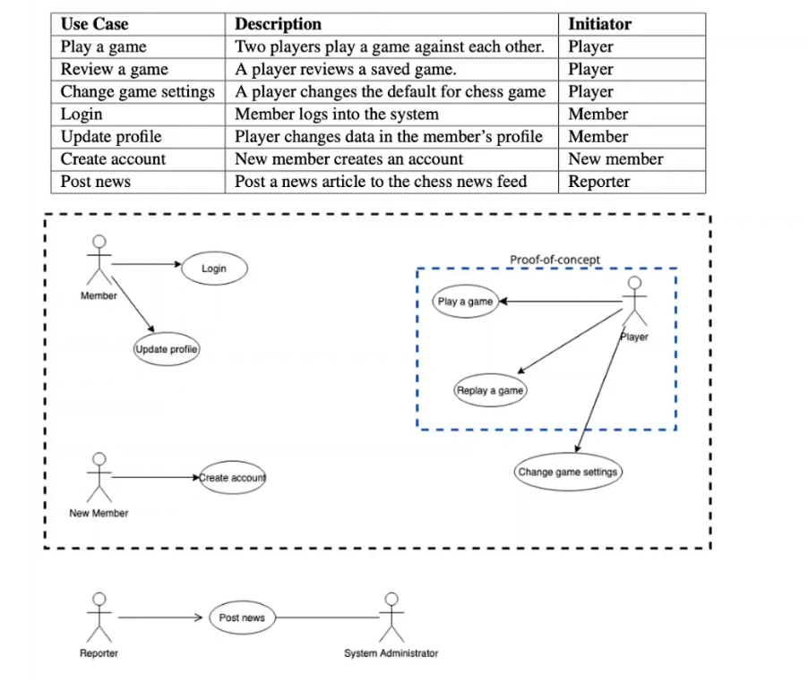
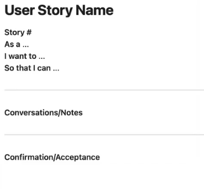
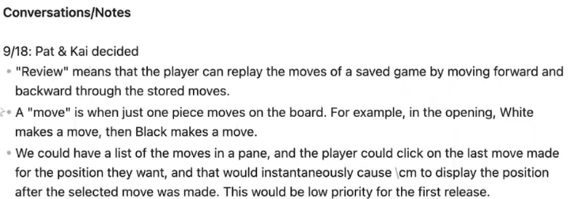
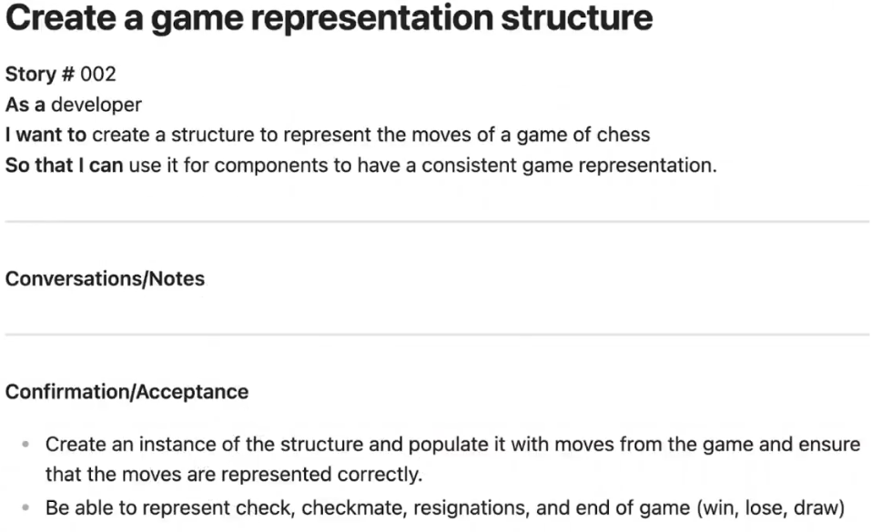
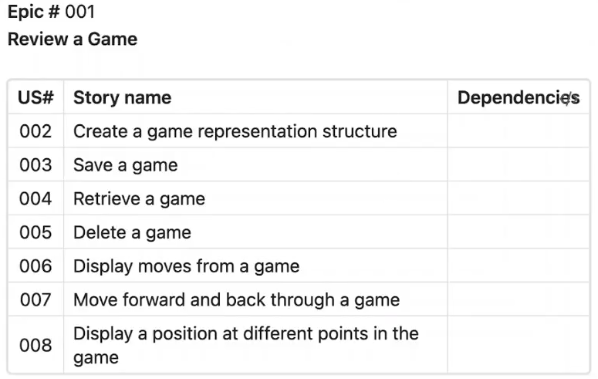

# Requirements

## What is a requirement?

- A requirement is a statement describing:
  - An aspect of what the proposed system must do
  - A constraint on the system's development
- In either case, it must contribute in some way towards adequately solving the customer's problem
- The set of requirements as a whole represents a negotiated agreement among the stakeholders
- In short: **What should be done, not how**

---

- **Requirements Engineering** is the process of establishing requirements.
- A collection of requirements is a **Software REquirements Specification** document
  - In scrum, this is the product backlog

---

## Requirements Analysis

- Used to understand what each stakeholder expects from our product
- decide if a feasible software system is possible to meet th expectations
- ensure that the requirements are consistent, without conflicts

## Use Cases - with UML

 A Use case is a complete sequence of events, initiated by an actor that provides value

- **Specifications**
  - Name
    - Review a saved game
  - Brief Description
    - Provides a registered player the opportunity to review a game they previously played.
  - Actors
    - Player
  - Pre-conditions
    - The player must have an account and be logged in
    - The player must have at least one saved game.
  - Post-conditions
    - There is no change to the state of the system. The player must have viewed none, all, or a part of a saved game.
  - Basic path - AKA flow of events
  - Alternate paths - Variations to achieve the same events

### Use case diagram

### Advantages

- A UML diagram makes it easy to see the whole picture of a complex system
- Use cases focus on the experience of the users and other stakeholders
- Since use cases are written in a natural language, most stakeholders can understand the requirements without special training
- Well written use cases are complete and easy to understand and analyze the functional requirements of a system for consistency and completeness
- Use cases are good at helping to decompose a large project into major functions
- USe cases help identify the main abstractions and connections between them
- use cases are very good when trying to evaluate architectural features of a system under development.

### Disadvantages

- The use case specifications can become very long, depending upon the level and amount of detail that it contains
- Since the specification is written in natural language (English), ambiguity and lack of clarity may become an issue
- Modifying large use case specifications can become quite complicated and time consuming to ensure that the modifications have been stated correctly and all possible side-effects have been identified
- some systems and applications are not appropriate for use cases; for example, a compile for a new programming language or a library of algorithms

---

## Behavior-Driven Development (BDD)

- This approach to software design evolved from Test-Driven Development (TDD)
- Requirements are written as "**scenarios**" which are test cases of how (part of) a system should behave given specific prompts
- typically, couples with testing platform, like Cucumber
- **BDD Feature:** A BDD feature is a piece of software functionality that helps users or other stakeholders achieve some business goal
- A complete set of scenarios defines a feature

### Examples

Scenario: Create new Profile with minimal entries

- **Given** that the person has selected New Account from the user interface
- **When** the person enters a valid, unique username
- **And** enters a validly formed email
- **And** enters a first and last name
- **And** selects Create new account
- **Then** a new account is added to the ChessMaster accounts with the
  - correct username, email, and last name
- **And** the rating of the new account is 0

 

Scenario representing executable tests: Create new profile with valid minimal entries
> provide examples of the scenario instance that have enough detail to describe exactly what happens.

- **Given** that the person has selected New Account from the user interface
- **And** there is no existing account for "pjones93"
- **When** the person enters "pjones93" for the username
- **And** enters a "pjones93@gmail,com" for the email
- **And** enters "Pat" for the first name
- **And** enters "Jones" for the last name
- **And** selects Create new account
- **Then** a nev account created
- **And** the username of the account is "pjones93"
- **And** the account email is "pjones93"
- **And** the first name of the account is "Pat"
- **And** the last name of the account is "Jones"
- **And** the ratings of the account = 0

---

## Analysis with User Stories

**User Story** is a description of functionality tht will be valuable to either a uer or purchaser of a system or software

- They are another way of describing functional requirements
- they became popular when the agile movement gained traction

### Structure

1) **The story** is a written representation of a customer requirement
   1) 
2) **The notes** are records of **conversations** hat occur and clarify the requirement
   1) 
3) **The confirmation** is the acceptance criteria that indicate the conditions that must be met before the story is complete and ready to go into the release
   1) 

### Epic User Stories

- Typically a user story represents one developer's task that might take a day or less
- If a task is too large it can be defined as an epic
- **Epic User Story:** An epic is a large user story that cannot be delivered as defied within a single iteration or is large enough that it can be split into smaller stories
  

### Advantages of User Stories

- User stories are fairly easy to delete and rewrite or split; especially if they are independent.
- User stories promote conversation between all members of the team.
- User stories are simple and easy to learn to write and read.
- User stories are a planning tool as well as a requirements specification tool.
- Many tools and techniques use some form of user story, such as Scrum and Kanban.
- User stories are flexible. Not only are epics possible, but they can be used for non-functional requirements.

### Disadvantages of User Stories

- The actual flow of the scenarios are not obvious. While user story maps can show dependencies, they do not show the sequencing of the steps.
- The user stories may not contain enough information to fully detail requirements. They require conversations, and the results of the conversations must be added to the user story.
- User stories may not be sufficient for large, complex projects. For large project, the number of user stories can become unwieldy.
