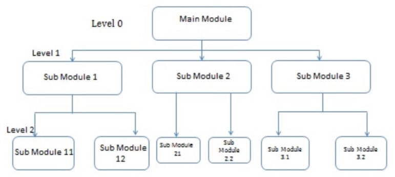
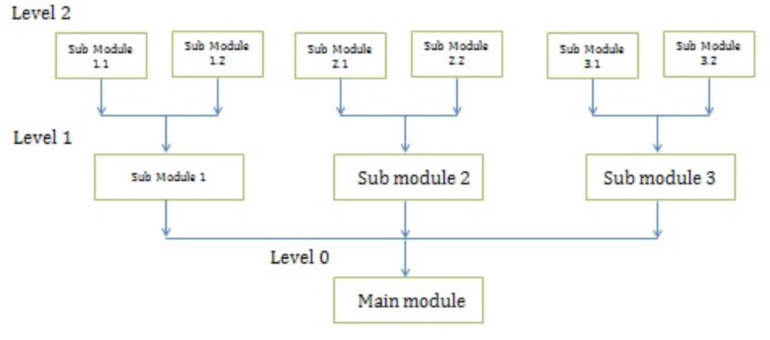
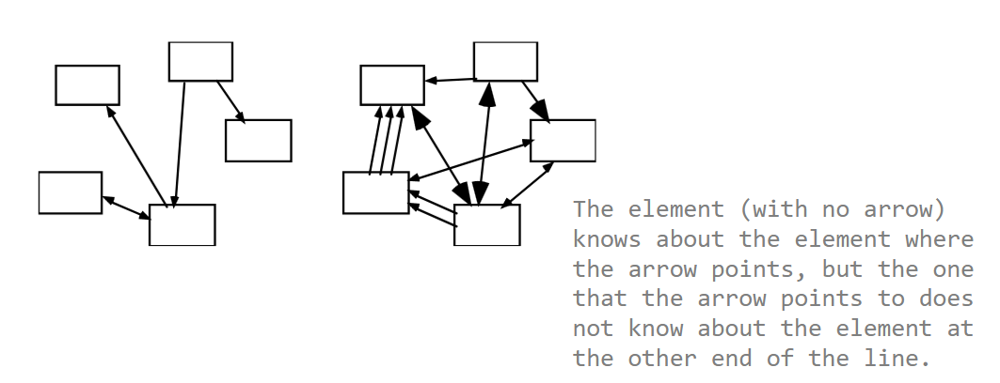
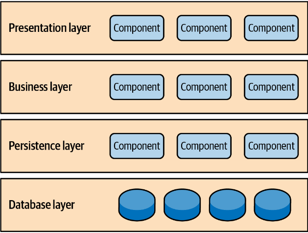
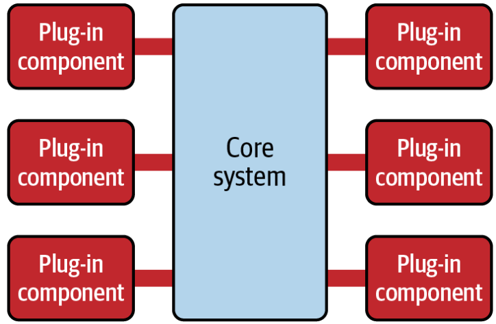
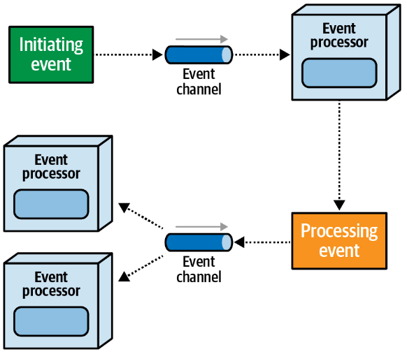
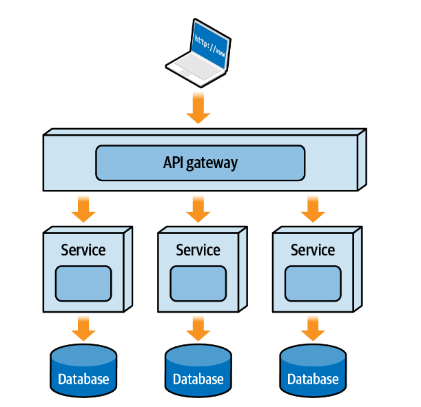
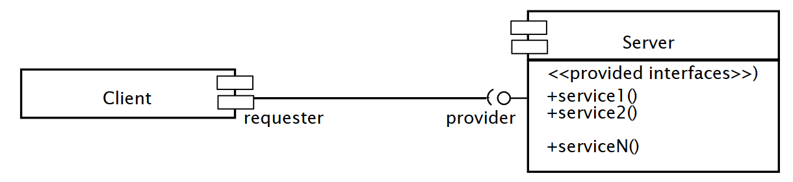

# Design

Bridge the gap between a problem and an implemented system in a manageable way.

Requirements -> Software Design -> Implemented system

## Formal Definition

A design is a problem-solving process whose objective is to find and describe:

- a way to implement the system's **functional requirements**
- while respecting the constraints imposed by the quality, platform, and process requirements
- and while adhering to general principles of good quality

## Aspects of Design

1) Architecture Design

- The division of modules and components,
  - How they will be connected
  - How they will interact
  - Their interfaces

2) Class Design

- The various features of classes

3) Data/Database design

4) User interface design

5) Algorithm design

- The design of computational mechanisms

6) Protocol design

- The design of communications protocol.

## Software Architecture

- A systems software architecture is the set of significant design decisions about how the software is organized to promote desired quality attributes and other properties
- There are two way sof constructing a software design:

### Top-down Architecture Design

- Starts with the big picture of the system
- Divides it up into parts that suggest some sort of modularity
- These parts might also be divided into smaller parts, and so on
- Each of these leaf components should have a single purpose

### Bottom-up Architecture Design

- Starts by defining the smallest modules that have a single purpose.
- These small modules cannot, or should not, be split up into even smaller sub-modules
- They are combined into larger logical components until the complete system is defines

## Coupling - want to minimize

Coupling measures interdependencies between one subsystem and another

- **High coupling**: Modifications to one subsystem will have high impact on the other subsystem (change of model, massive recompilations, refactoring)
- **Low coupling**: Systems are relatively independent from each other

## Cohesion - want to maximize

Cohesion is a measure of how an entity has only one task or responsibility

- A system has **high cohesion** if it keeps together things that are related to each other, and keeps out other things

## Architectural Patterns

- Decide on an initial structure of the overall system, and decide where the modules will reside.
- The notion of patterns can be applied to software architecture
  - These are called **architectural patterns or architectural styles**
  - Each allows you to design flexible systems using components - where components are as independent of each other as possible

### Layered

- Layered is an architecture organized as a set of layers where functions—
transactions, events, and so on—are processed through a set of layered
actions.
- Each layer of the layered architecture style has a specific role and responsibility
within the application.
- **A layer** is a module that provides services to another layer:
  - A layer only depends on services from lower layers
  - A layer has no knowledge of higher layers

### Microkernel

- Microkernel is a system that has a core and a set of plug-in components that provide specific capabilities.

### Event driven

- Event-driven relies on event processors to handle asynchronous events.
  - A modification on this theme is message-drive systems where, instead of events that indicate something happened, messages are communicated to indicate that something needs to occur

### Microservices

- Microservices is an architecture that is based upon loosely coupled services that are deployed independently.
  - Fault tolerance and scalability are the major benefits
  - Often very high cost and very complex

### Client-Server

- Each client calls on the server, which performs some service and returns the result
  - The clients know the interface of the server
  - The server does not need to know the interface of the client
- The response in general is immediate
- End users interact only with the client.