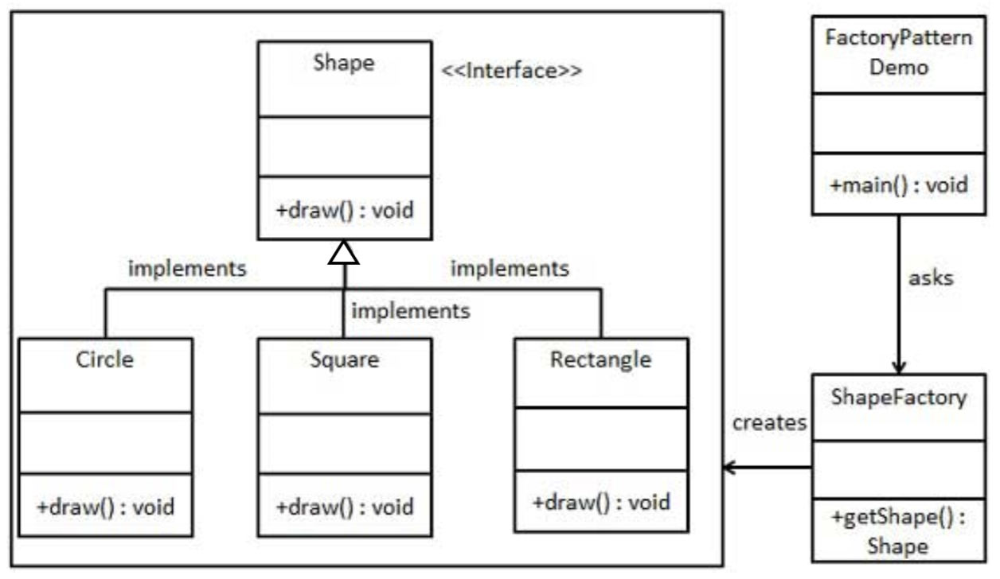
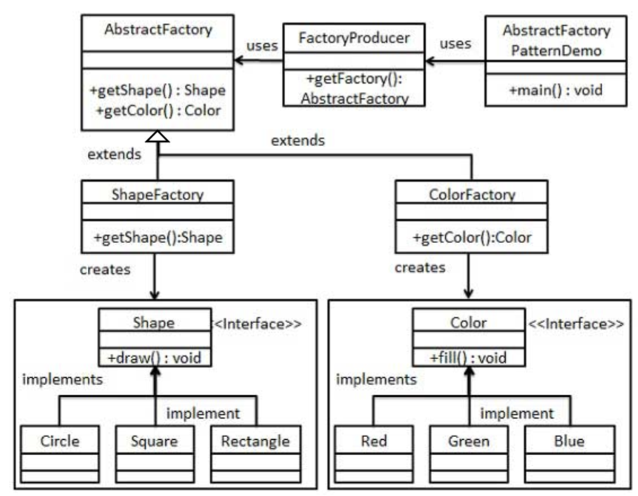

# Creational Pattern - Factory Patterns

## 1. Factory Method Pattern (problem)

```Java
public interface Shape{
    public void draw();
}

public class Rectangle implements Shape {
    @Override
    public void draw() {
        System.out.println("Rectangle::draw() method.");
    }
}

public class Square implements Shape {
    @Override
    public void draw() {
        System.out.println("Square::draw() method.");
    }
}
```

- Client use the supertype (`Shape`)
- But still need to use `Rectangle` or `Square` constructor
- Don't want to change code to use a different constructor

## 1. Factory Method Pattern (solution)



- In Factory pattern, we create object without exposing the creation logic to the client and refer the newly created object using a common interface.

```Java
public class ShapeFactory {
  //use getShape method to get object of type shape
  public Shape getShape(String shapeType){
    if (shapeType.equalsIgnoreCase("CIRCLE")){
      return new Circle();
    } else if(shapeType.equalsIgnoreCase("RECTANGLE")){
      return new Rectangle();
    } else if(shapeType.equalsIgnoreCase("SQUARE")){
      return new Square();
    }
    return null;
  }
}
```

- Clients call `getShape` instead of a particular constructor
- **Advantages**:
  - To switch the implementation, only change one place
  - `getShape` can do arbitrary computations to decide what kind of shape to create
- Frequently used in frameworks (e.g., Java swing)
  - BorderFactory.createRaisedBevelBorder()

## 1. Factory Method Pattern - demo

```Java
public class FactoryPatternDemo {
  public static void main(String[] args) {
    ShapeFactory shapeFactory = new ShapeFactory();
    //get an object of Rectangle and call its draw method.
    Shape shape1 = shapeFactory.getShape(args[0]);
    //call draw method of Rectangle
    shape1.draw();
    //get an object of Square and call its draw method.
    Shape shape2 = shapeFactory.getShape(args[1]);
    //call draw method of circle
    shape2.draw();
  }
}
FactoryPatternDemo(["RECTANGLE","SQUARE","CIRCLE"]);
```

- We can now use the Factory to get objects of concrete class by passing an information such as type.

## 2. Abstract Factory Pattern

- Abstract Factory patterns involve a "super-factory" which creates other factories. This factory is also called as factory of factories.
- In abstract factory pattern an interface is responsible for creating a factory of related objects without explicitly specifying their classes
- Use the Factory pattern and Abstract Factory pattern in any of the following situations:
  - a system should be independent of how the objects are created, composed and represented
  - A class can't anticipate the class of objects it must create



## 2. Abstract Factory Pattern Example

### Step 1

- Create an interaface for `Shapes`
- Create concrete classes implementing the `Shapes` interface.

```Java
public interface Shape{
  void draw();
}

public class Rectangle implements Shape {
  @Override
  public void draw() {
    System.out.println("Rectangle::draw() method.");
  }
}

public class Square implements Shape {
  @Override
  public void draw() {
    System.out.println("Square::draw() method.");
  }
}

public class Circle implements Shape {
  @Override
  public void draw() {
    System.out.println("Circle::draw() method.");
  }
}
```

## Step 2

- Create an interface for `Colors`
- Create a concrete classes implementing the `Colors` interface

```Java
public interface Color{
  void fill();
}

public class Red implements Color{
  @Override
  public void fill() {
    System.out.println("Red::fill() method.");
  }
}

public class Green implements Color{
  @Override
  public void fill() {
    System.out.println("Green ::fill() method.");
  }
}

public class Blue implements Color{
  @Override
  public void fill() {
    System.out.println("Blue ::fill() method.");
  }
}
```

### Step 3

- Create an Abstract class to create factories for `Color` and `Shape` objects

```Java
public abstract class AbstractFactory {
  abstract Color getColor(String color);
  abstract Shape getShape(String shape) ;
}
```

### Step 4

- Create factory classes extending `AbstractFactory` to generate object of concrete class based on given information

```Java
public class ShapeFactory extends AbstractFactory {

  @Override
  public Shape getShape(String shapeType){
    if(shapeType.equalsIgnoreCase("CIRCLE")){
      return new Circle();
    }else if(shapeType.equalsIgnoreCase("RECTANGLE")){
      return new Rectangle();
    }else if(shapeType.equalsIgnoreCase("SQUARE")){
      return new Square();
    }
    return null;
  }

  @Override
  Color getColor(String color) {
    return null;
  }
}

public class ColorFactory extends AbstractFactory {

  @Override
  public Shape getShape(String shapeType){
    return null;
  }

  @Override
  Color getColor(String color) {
    if(color.equalsIgnoreCase("RED")){
      return new Red();
    }else if(color.equalsIgnoreCase("GREEN")){
      return new Green();
    }else if(color.equalsIgnoreCase("BLUE")){
      return new Blue();
    }
    return null;
  }
}
```

## Abstract Factory Pattern Example Demo

- Use the `FactoryProducer` to get `AbstractFactory` in order to get factories of concrete classes by passing an information such as type

```Java
public class AbstractFactoryPatternDemo {
  public static void main(String[] args) {

    //get shape factory
    AbstractFactory shapeFactory = FactoryProducer.getFactory("SHAPE");

    //get an object of Shape Circle
    Shape shape1 = shapeFactory.getShape("CIRCLE");
    shape1.draw(); //call draw method of Shape Circle

    //get an object of Shape Rectangle
    Shape shape2 = shapeFactory.getShape("RECTANGLE");
    shape2.draw(); //call draw method of Shape Rectangle

    //get color factory
    AbstractFactory colorFactory = FactoryProducer.getFactory("COLOR");

    //get an object of Color Red
    Color color1 = colorFactory.getColor("RED");
    color1.fill(); //call fill method of Red

    //get an object of Color Blue
    Color color3 = colorFactory.getColor("BLUE");
    color3.fill(); //call fill method of Color Blue
  }
}
```


