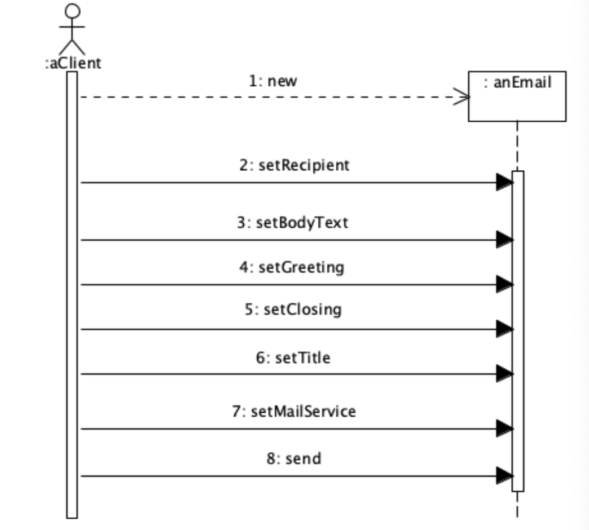
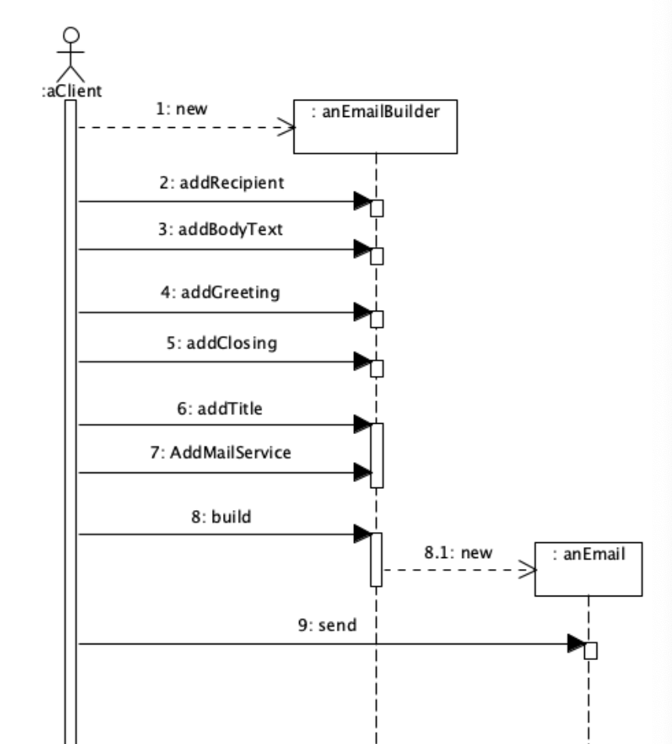
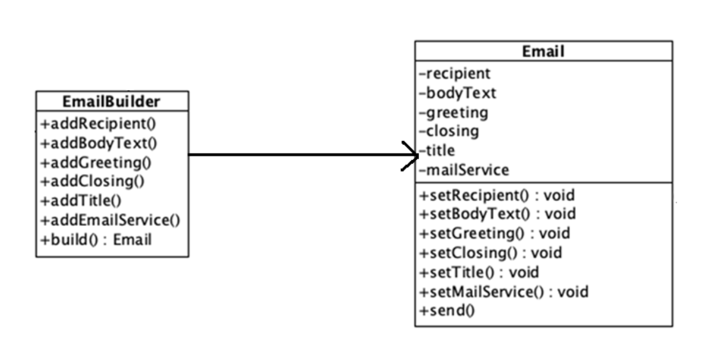
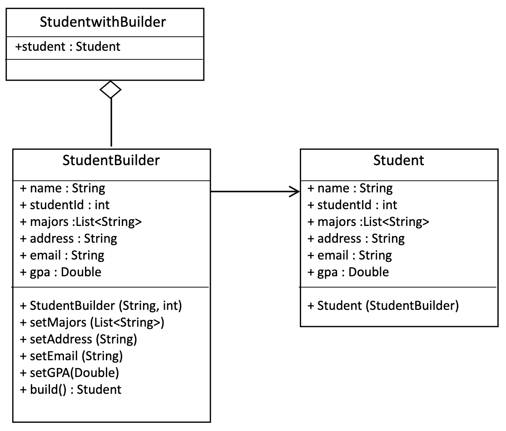
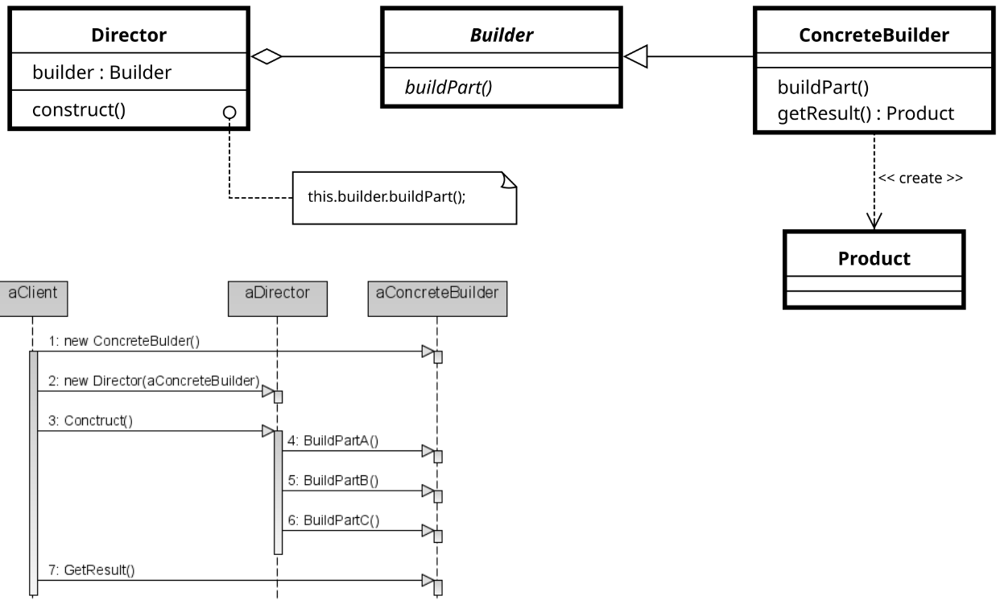
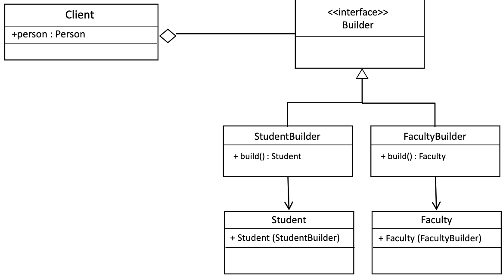

# Creational Pattern - Builder

- Some objects are complex and have special requirements for creating them
  - A lot of variability or attributes
    - Constructors would be complex and error prone
  - Sequencing issues
  - Complex components
- We want to ensure that they are created correctly
- Factories adn factory methods don't quite give us the safety we need

## Example: Email

- Without Builder



- With Builder



- UML diagram



## Example: Student - without Builder

> Note: all below code is in `../code/3/BuilderExample-solution`

```Java
class Student {
  private String name;
  private int studentId;
  private List<String> majors;
  private String address;
  private String email;
  private Double gpa;

  // Constructor with all fields (Even if some are optional)
  public Student(String name, int studentId, List<String> majors,
  String address, String email, Double gpa) {
    this.name = name;
    this.studentId = studentId;
    this.majors = majors;
    this.address = address;
    this.gpa = gpa;
    this.email = email;
  }

  @Override
  public String toString() {
    return "Student [Name=" + name + ", Student ID=" + studentId +
  ", Majors:"+ majors.stream().reduce(" ", (a, b) -> a + " " + b) +
  ", Address=" + address + ", Email=" + email + "]"; 
  }
}

public class StudentExample {
    public static void main(String[] args) {
      // Creating a student - Hard to read
      Student student = new Student("Alice", 101, List.of("CS", "RBE", "DS"), "WPI","snow@wpi.edu", 4.0);
      System.out.println(student);
    }
}
```

- **Problems**:
  - The constructor *forces* tonprovide all parameters, even if some are optional
    - ex: If student doesnt have an emaile, we still need to pass `null`.
  - Hard to read and maintain when more fields are added

## Example: Student - with Builder



```Java
// Step 1: Define the Student Class
public class Student {
  private String name;
  private int studentId;
  private List<String> majors;
  private String address;
  private String email;
  private Double gpa;

  // Private constructor to enforce object creation via Builder
  public Student(StudentBuilder builder) {
    this.name = builder.getName();
    this.studentId = builder.getStudentId();
    this.majors = builder.getMajors();
    this.address = builder.getAddress();
    this.email = builder.getEmail();
    this.gpa = builder.getGPA();
  }

  public String toString() {
    return "WithoutBuilder.Student [Name=" + name + ", Student ID=" + studentId +
    ", Address=" + address +
    ", Majors:" + majors.stream().reduce(" ", (a, b) -> a + " " + b) +
    ", Address=" + address + ", Email=" + email + "]";
  }
}

// Step 2: Define the Builder Class
public class StudentBuilder {

  // Required fields
  private String name;
  private int studentId;

  // Optional fields with default values
  private List<String> majors = List.of();
  private String address = "Not Provided";
  private String email = "Not Provided";
  private Double gpa = 0.0;

  // Constructor with required fields
  public StudentBuilder(String name, int studentId) {
    this.name = name;
    this.studentId = studentId;
  }

  // Methods to get private attributes
  public int getStudentId() { return this.studentId; }
  public String getName() { return this.name; }
  public List<String> getMajors(){ return this.majors;}
  public String getAddress(){ return this.address;}
  public String getEmail(){ return this.email;}
  public Double getGPA(){ return this.gpa;}

  // Methods to set optional parameters
  public StudentBuilder setMajors(List<String> majors) {
    this.majors = majors;
    return this;
  }

  public StudentBuilder setAddress(String address) {
    this.address = address;
    return this;
  }

  public StudentBuilder setEmail(String email) {
    this.email = email;
    return this;
  }

  public StudentBuilder setGPA(Double gpa) {
    this.gpa = gpa;
    return this;
  }

  // Build method to return the final Student object
  public Student build() {
    return new Student(this);
  }
}

// Step 3: Use the Builder object in Main Method
public class StudentwithBuilder {
  public static void main(String[] args) {
    // Creating a student with full details
    Student student1 = new StudentBuilder("Snow", 251)
      .setMajors(List.of("CS","RBE","DS"))
      .setAddress("WPI")
      .setEmail("snow@wpi.edu")
      .setGPA(4.0)
      .build();

    // Creating a student with only required details
    Student student2 = new StudentBuilder("Cookie", 451).build();
    
    // Creating a student with gpa and email only
    Student student3 = new StudentBuilder("Cat", 122)
      .setGPA(3.5)
      .setEmail("cat@wpi.edu")
      .build();
    
    System.out.println(student1);
    System.out.println(student2);
    System.out.println(student3);
  }
}
```

## Example: Builder UMLs

- Builder Pattern - GoF Solution



- Student and Faculty Builders


