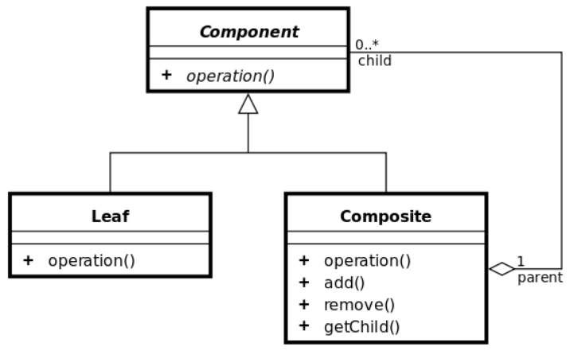
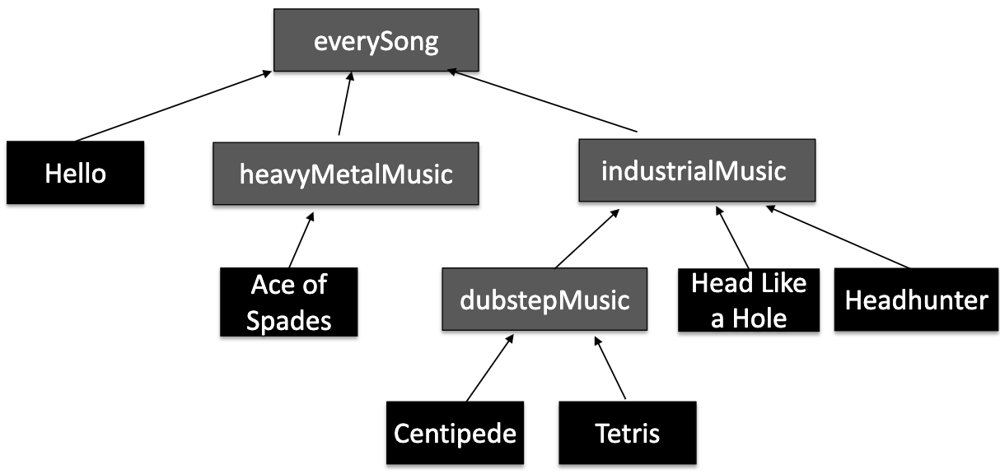
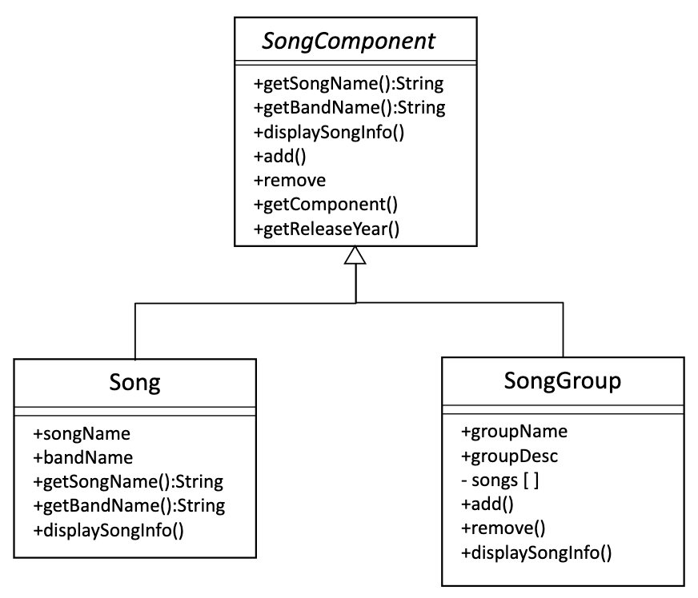
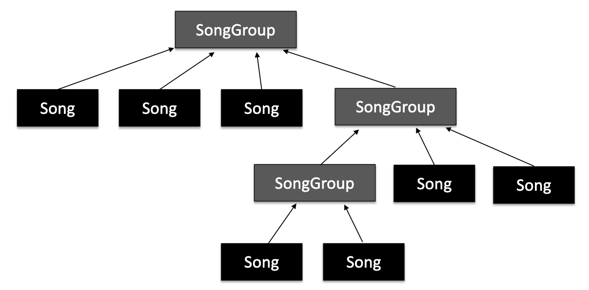
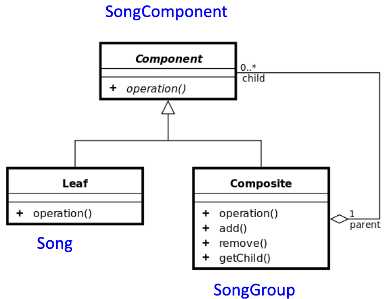
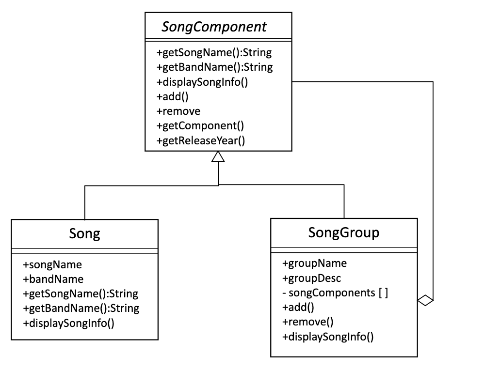
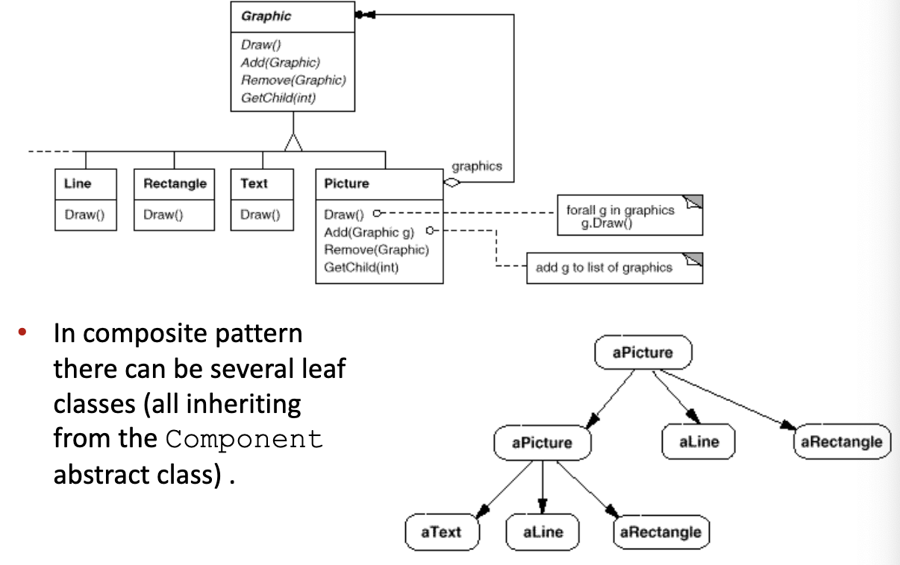

# Structural pattern - Composite



- allows you to treat individual objects as composition of objects uniformly
- allows you to represent part-whole hierarchies uniformly
  - Components can be further divided into smaller components

## Example: Song playlistæ



> Note: all below code is in `../code/3/CompositeExample-solution`


```Java
public class Song {
  String songName;
  String bandName;
  int releaseYear;
  
  public Song(String newSongName, String newBandName, int newReleaseYear){
    songName = newSongName;
    bandName = newBandName;
    releaseYear = newReleaseYear;
  }
}

public class SongGroup {
  ArrayList <Song> songs = new <Song> ArrayList();
  
  String groupName;
  String groupDescription;
  
  public SongGroup(String newGroupName, String newGroupDescription){
    groupName = newGroupName;
    groupDescription = newGroupDescription;
  }
  ...
}

public static void main(String[] args){
  SongGroup industrialMusic = new SongGroup("Industrial",
    "is a style of experimental music with provocative themes");
  SongGroup heavyMetalMusic = new SongGroup("\nHeavy Metal",
    "is a genre of rock that developed in the late 1960s");
  SongGroup dubstepMusic = new SongGroup("\nDubstep",
    "is a genre of electronic dance music");

  SongGroup everySong = new SongGroup("Song List","All Songs");

  industrialMusic.add(new Song("Head Like a Hole", "NIN", 1990));
  industrialMusic.add(new Song("Headhunter", "Front 242", 1988));

  dubstepMusic.add(new Song("Centipede", "Knife Party", 2012));
  dubstepMusic.add(new Song("Tetris", "Doctor P", 2011));
  everySong.add(new Song("Hello", "Adele", 2015));
  heavyMetalMusic.add(new Song("Ace of Spades", "Motorhead", 1980));

  everySong.displaySongInfo();
  heavyMetalMusic.displaySongInfo();
  industrialMusic.displaySongInfo();
  dubstepMusic.displaySongInfo();
}

```



## Example: song playlist with composite

- a composite can contain never ending groupings



- UML diagrams:




- `SongComponent` Abstract class (component):
  - This acts as an interface for every Song (leaf) and SongGroup (composite) we create

```Java
public abstract class SongComponent {
  // Add components
  abstract void add(SongComponent newSongComponent) ;

  // Remove components
  abstract void remove(SongComponent newSongComponent);

  // Get component
  abstract SongComponent getComponent(int componentIndex);

  // Retrieve song names
  abstract String getSongName();

  // Retrieve band names
  abstract String getBandName();

  // Retrieve release year
  abstract int getReleaseYear();

  // When this is called by a class object
  // that extends SongComponent it will
  // print out information specific to the
  // Song or SongGroup
  abstract void displaySongInfo();
}
```

- `SongGroup` class (Composite):

```Java
public class SongGroup extends SongComponent {

  // Contains any Songs or SongGroups that are added to this ArrayList
  ArrayList <SongComponent> songComponents = new <SongComponent> ArrayList();

  String groupName;
  String groupDescription;

  public SongGroup(String newGroupName, String newGroupDescription){
    groupName = newGroupName;
    groupDescription = newGroupDescription;
  }

  public String getGroupName() { return groupName; }

  public String getGroupDescription() {return groupDescription;}

  public void add(SongComponent newSongComponent) {
    songComponents.add(newSongComponent);
  }
  public void remove(SongComponent newSongComponent){
    songComponents.remove(newSongComponent);
  }

  public SongComponent getComponent(int componentIndex) {
    return (SongComponent)songComponents.get(componentIndex);
  }

  public void displaySongInfo(){
    System.out.println(getGroupName()+" "+getGroupDescription());
    // Cycles through and prints any Songs or SongGroups added
    // to this SongGroups ArrayList songComponents
    Iterator songIterator = songComponents.iterator();
    while(songIterator.hasNext()) {
      SongComponent songInfo = (SongComponent) songIterator.next();
      songInfo.displaySongInfo();
    }
  }

  // raise an exception if a Song method is called
  String getSongName() { throw new UnsupportedOperationException("message");}

  // Retrieve band names
  String getBandName(){ throw new UnsupportedOperationException("message");} ;

  // Retrieve release year
  int getReleaseYear(){ throw new UnsupportedOperationException("message");} ;
}

```

- `Song` class (Leaf):

```Java
public class Song extends SongComponent {
  String songName;
  String bandName;
  int releaseYear;

  public Song(String newSongName, String newBandName, int newReleaseYear){
    songName = newSongName;
    bandName = newBandName;
    releaseYear = newReleaseYear;
  }

  public String getSongName() { return songName; }
  public String getBandName() { return bandName; }
  public int getReleaseYear() { return releaseYear; }
  
  public void displaySongInfo(){
    System.out.println(" *" + getSongName() + " was recorded by " + getBandName() + " in " + getReleaseYear());
  }

  // raise an exception if a SongGroup method is called
  void add(SongComponent newSongComponent) { throw new UnsupportedOperationException("message");} ;
  void remove(SongComponent newSongComponent){ throw new UnsupportedOperationException("message");} ;
  SongComponent getComponent(int componentIndex){ throw new UnsupportedOperationException("message");} ;
}
```

- Client Program

```Java
public class SongListGenerator {

  public static void main(String[] args){

  SongComponent industrialMusic = new SongGroup("Industrial", "is a style of experimental music with provocative themes");

  SongComponent heavyMetalMusic = new SongGroup("\nHeavy Metal", "is a genre of rock that developed in the late 1960s");
   SongComponent dubstepMusic = new SongGroup("\nDubstep", "is a genre of electronic dance music");

  // Top level component that holds everything
  SongComponent everySong = new SongGroup("Song List","All Songs");

  // Composite holding individual groups of songs and
  // a SongGroup with Songs
  everySong.add(industrialMusic);

  industrialMusic.add(new Song("Head Like a Hole", "NIN", 1990));
  industrialMusic.add(new Song("Headhunter", "Front 242", 1988));
  industrialMusic.add(dubstepMusic);
  
  dubstepMusic.add(new Song("Centipede", "Knife Party", 2012));
  dubstepMusic.add(new Song("Tetris", "Doctor P", 2011));
  everySong.add(new Song("Hello", "Adele", 2015));

  everySong.add(heavyMetalMusic);
  heavyMetalMusic.add(new Song("Ace of Spades", "Motorhead", 1980));
  
  everySong.displaySongInfo();
  }
}
```

## Another Composite Pattern example


