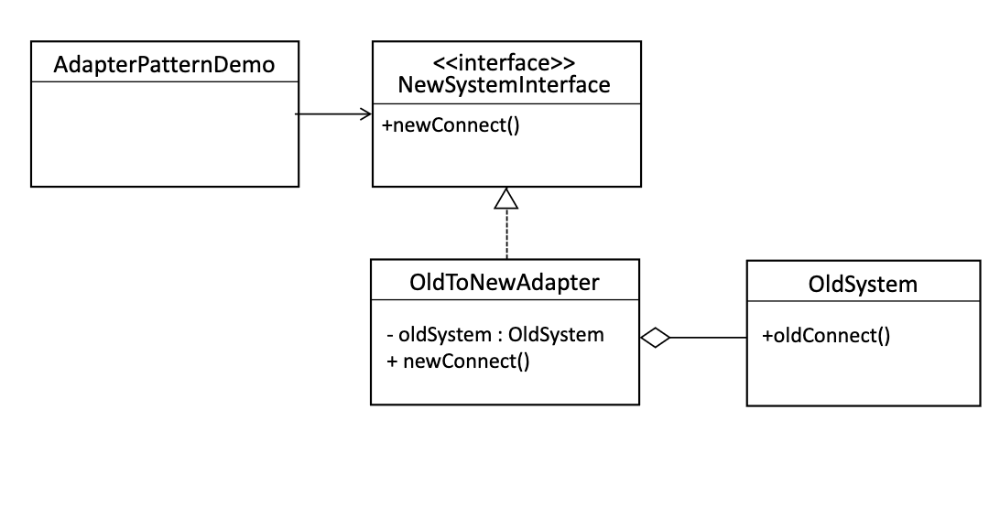

# Adapter Pattern


- The Adapter Pattern converts the interface of a class into another
interface the clients expect. Adapter lets classes work together that
couldn’t otherwise because of incompatible interfaces
- In short **an adapter pattern is a compatability layer**.


## Example code

```Java
class OldSystem {
    //The old system with its own method
    void oldConnect() {
        System.out.println("Connected using Old System");
    }
}

class NewSystem {
    //The new system with a different interface
    void newConnect() {
        System.out.println("Connected using New System");
    }
}

// Trying to connect them directly will not work
public class AdapterPatternDemo {
    public static void main(String[] args) {
        NewSystem newSystem = new NewSystem();
        OldSystem oldSystem = new OldSystem();

        //The new system expects classes to implement this interface.
        newSystem.newConnect(); // Works for new system
        // oldSystem.newConnect(); // Does not work
        // But there's no direct way to connect the old system to the new one
    }
}
```

- The `OldSystem` has a method called `oldConnect()`, however the `NewSystem` expects a new interface which has a method `newConnect`.
- We cannot directly use the `OldSystem` in the new system without making changes to the legacy code, which we want to avoid.

## Example code: solution



```Java
class OldSystem {
    void oldConnect() {
        //The old system with its own method
        System.out.println("Connected using Old System");
    }
}

interface NewSystemInterface {
    //Step 1: define an interface for the new system
    void newConnect();
}

class OldToNewAdapter implements NewSystemInterface {
    private OldSystem oldSystem;

    public OldToNewAdapter(OldSystem oldSystem) {
        this.oldSystem = oldSystem;
    }

    @Override
    public void newConnect() {
        //Step 2: The adapter makes the old system compatible with the new system
        System.out.println("Adapting Old System to New System...");
        oldSystem.oldConnect(); // Internally using the old system's method
    }
}

public class AdapterPatternDemo {
    public static void main(String[] args) {
        //Step 3: Use the adapter to connect old system with the new one
        OldSystem oldSystem = new OldSystem();
        NewSystemInterface adapter = new OldToNewAdapter(oldSystem); // Adapter wraps old system
        adapter.newConnect(); // Now the new system can work with the old system
    }
}
```

## Real-world Adapters

- Java Enumerators
- 
- Java Iterators
- 
- Adapting an Enumeraton to an Iterator:
  - Using `Enumerators` with code that expects `Iterators`, we are sometimes faced with legacy code that exposes the Enumeration interface, but we want our new code to only use Iterators.
  - 
