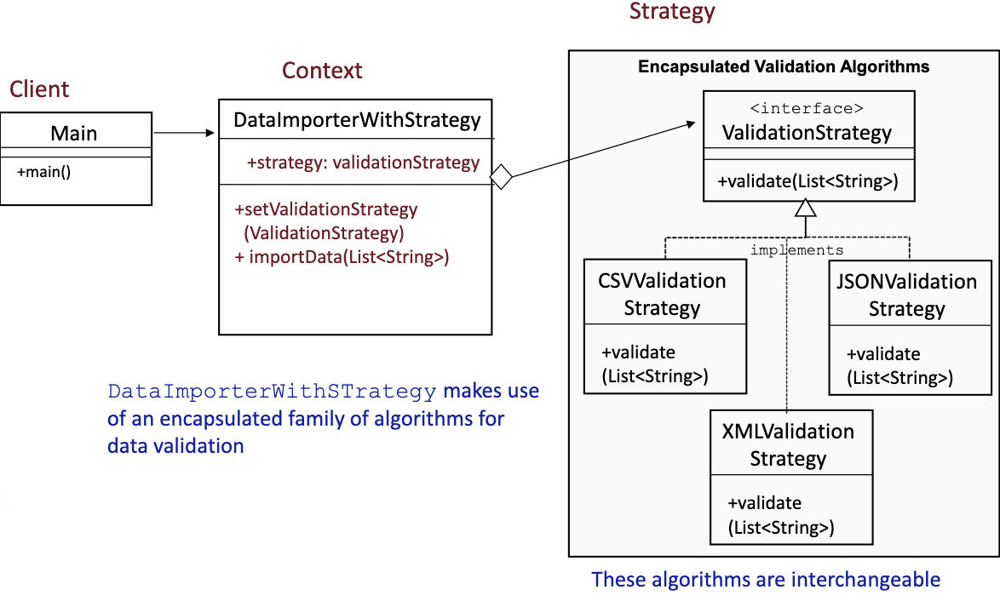

# Strategy Pattern

- The Strategy DEsign Pattern defines a family of algorithms, encapsulates each one, and makes them interchangeable.
  - Strategy lets the algorithm changed independently from the clients that use it
- Use the strategy pattern when you need to use onw of several behaviors dynamically


## Example (without pattern)

- When importing data into a new system, different validation algorithms may be rerun based on the data set.
  
```Java
// Without the Strategy Pattern 
// (using conditional logic to determine which validation to apply)
class DataValidator {
    void validate(String type, List<String> data) {
        
        if ("CSV".equalsIgnoreCase(type)) {
            // CSV validation logic
            System.out.println("Validating CSV data");
        } else if ("JSON".equalsIgnoreCase(type)) {
            // JSON validation logic
            System.out.println("Validating JSON data");
        } else if ("XML".equalsIgnoreCase(type)) {
            // XML validation logic
            System.out.println("Validating XML data");
        } else {
            throw new IllegalArgumentException("Unknown data type: "+type);
        }
    }
}
class DataImporter {
    private DataValidator validator = new DataValidator();

    void importData(String type, List<String> data) {
        validator.validate(type, data);
        System.out.println("Successfully imported " + type + " data.");
  }  
}

// Usage Example
class BeforeStrategy {
    public static void main(String[] args) {
        List<String> sampleData = List.of("data1", "data2");

        // Without Strategy Pattern
        DataImporter importer1 = new DataImporter();
        importer1.importData("CSV", sampleData);
        // We need to update update DataValidator
        // to support new data formats.
        //importer1.importData("YAML", sampleData);
    }
}
```

- Imagine that over time new validation types are added:
  - YAML, XLSX, etc.
- This becomes hard to maintain:
  - Violation of the Open-Closed Principle (OCP)
    - Every time a new validation type is added, the validate method must be modified
    - this makes it harder to scale and increases the chances of introducing bugs.
  - Increased Complexity
    - The if-else structure gets longer and harder to read
    - Finding and modifying code for a specific validation logic is tedious
  
## Example (With pattern)

**With the Strategy Pattern** (removing conditional logic and dynamically selecting validation strategies)



```Java
// With Strategy Pattern
interface ValidationStrategy {
  void validate(List<String> data);
}

// CSV validation logic
class CSVValidationStrategy implements ValidationStrategy {
  public void validate(List<String> data) {
    System.out.println("Validating CSV data");
  }
}

// JSON validation logic
class JSONValidationStrategy implements ValidationStrategy {
  public void validate(List<String> data) {
    System.out.println("Validating JSON data");
  }
}

// XML validation logic
class XMLValidationStrategy implements ValidationStrategy {
  public void validate(List<String> data) {
    System.out.println("Validating XML data");
  }
}

class DataImporterWithStrategy {
  private ValidationStrategy strategy;

  void setValidationStrategy(ValidationStrategy strategy) {
    this.strategy = strategy;
  }

  void importData(List<String> data) {
    if (strategy == null) {
      throw new IllegalStateException("Validation strategy not set");
    }

    strategy.validate(data);
    System.out.println("Successfully imported data.");
  }
}

// Usage Example
class AfterStrategy {
  public static void main(String[] args) {
    List<String> sampleData = List.of("data1", "data2");

    // With Strategy Pattern
    DataImporterWithStrategy importer2 = new DataImporterWithStrategy();
    importer2.setValidationStrategy(new CSVValidationStrategy());
    importer2.importData(sampleData);
    // We can support new data format without updating the DataValidator
    //importer2.setValidationStrategy(new YAMLValidationStrategy());
    //importer2.importData(sampleData);
  }
}
```

- By applying the Strategy Pattern, each validation logic is encapsulated in its own class. This means:
  - No need to mofidy existing code to add a new validation type
  - The code becomes modular, makign it easier to test and maintain
  - New validations can be added dynamically without modifying the core logic.
