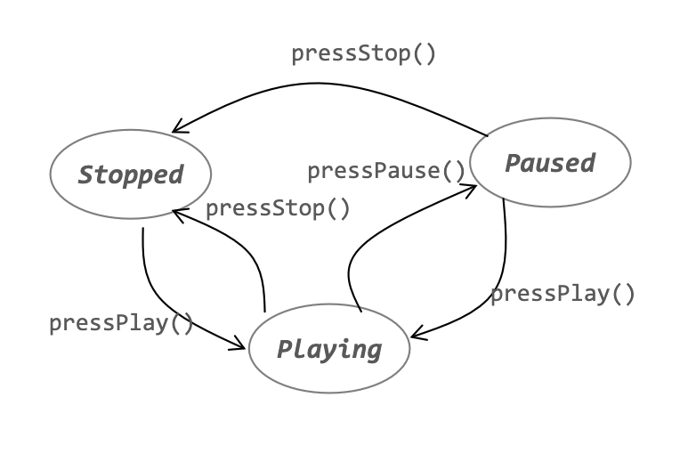
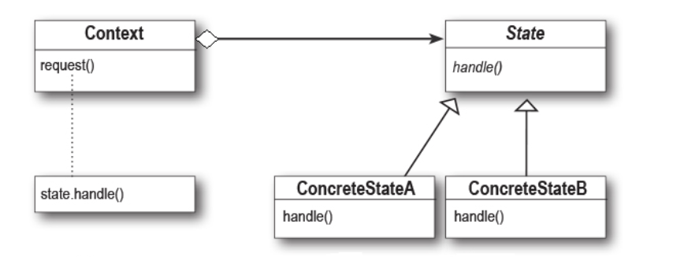
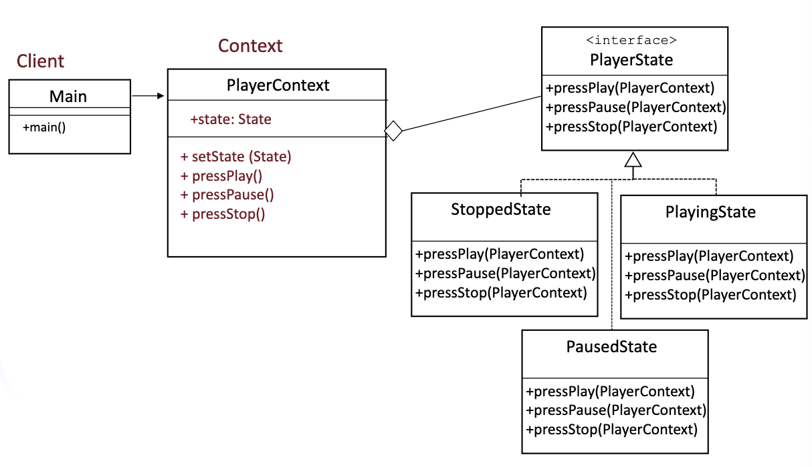
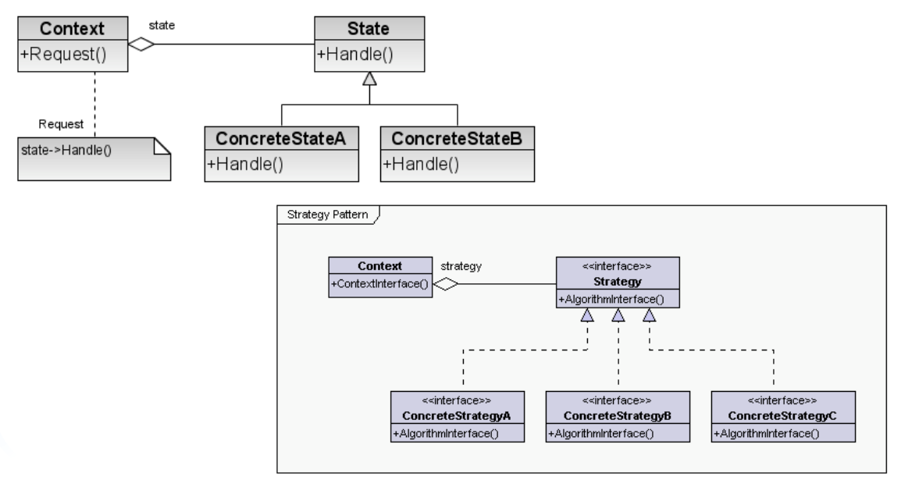

# State Pattern

- Similar to the Strategy pattern; exact same structure
- Strategy:
  - When multiple algorithms exist for a task, and oyu want to switch between them dynamically
  - The client explicitly chooses and applies a strategy
- State:
  - When an object's behavior changes based on its internal state
  - The objects transitions between different states automatically

## Example: Audio Player



- State machines areusually implemented with lots of conditional statements that select the appropriate behavior depending on the current state of the object

```Java
class AudioPlayer {
  private String state;
  public AudioPlayer() {
    this.state = "STOPPED";
  }

  public void pressPlay() {
    if (state.equals("STOPPED") || state.equals("PAUSED")) {
      state = "PLAYING";
      System.out.println("Audio is now PLAYING.");
    } else {
      System.out.println("Audio is already playing.");
    }
  }

  public void pressPause() {
    if (state.equals("PLAYING")) {
      state = "PAUSED";
      System.out.println("Audio is now PAUSED.");
    } else {
      System.out.println("Cannot pause. Audio not playing.");
    }
  }

  public void pressStop() {
    if (state.equals("PLAYING") || state.equals("PAUSED")) {
      state = "STOPPED";
      System.out.println("Audio is now STOPPED.");
    } else {
      System.out.println("Audio is already stopped.");
    }
  }
}

//Usage implementation
public class BeforeState {
  public static void main(String[] args) {
    AudioPlayer player = new AudioPlayer();
    player.pressPlay();
    player.pressPause();
  }
}
```

- Problems:
  - Too many if-else conditions, making the code harder to maintain
  - Violation of the open-closed principle as adding new states requires modifying the existing class
  - State transitions are not well encapsulated, makind debugging and extending difficult

## How to implement State Pattern

We encapsulate state objects in their own classes and then delegate to the current state when an action occurs.


1) First we define a State interface that contains a methods for every actions in the AudioPlayer Machine
2) Then we implement a State class for every state of the machine. These classes are responsible for the behavior of the machine when it is in teh corresponding state.
3) Finally, We get rid of all conditional code and instead delegate hte work to the State class

## Solution for Audio Player



```Java
// State interface
interface State {
   void pressPlay(PlayerContext context);
   void pressPause(PlayerContext context);
   void pressStop(PlayerContext context);
}

// Concrete States
class StoppedState implements State {
   public void pressPlay(PlayerContext context) {
      System.out.println("Audio is now PLAYING.");
      context.setState(new PlayingState());
   }
   public void pressPause(PlayerContext context) {
      System.out.println("Cannot pause. Audio is already stopped.");
   }
   public void pressStop(PlayerContext context) {
      System.out.println("Audio is already stopped.");
   }
}

class PlayingState implements State {
   public void pressPlay(PlayerContext context) {
      System.out.println("Audio is already playing.");
   }
   public void pressPause(PlayerContext context) {
      System.out.println("Audio is now PAUSED.");
      context.setState(new PausedState());
   }
   public void pressStop(PlayerContext context) {
      System.out.println("Audio is now STOPPED.");
      context.setState(new StoppedState());
   }
}

class PausedState implements State {
   public void pressPlay(PlayerContext context) {
      System.out.println("Resuming audio. Now PLAYING.");
      context.setState(new PlayingState());
   }
   public void pressPause(PlayerContext context) {
      System.out.println("Audio is already paused.");
   }
   public void pressStop(PlayerContext context) {
      System.out.println("Audio is now STOPPED.");
      context.setState(new StoppedState());
   }
}

// Context Class
class PlayerContext {
   private State state;
   public PlayerContext() {
      this.state = new StoppedState(); // Initial state
   }

   public void setState(State state) { this.state = state; }
   public void pressPlay() { state.pressPlay(this); }
   public void pressPause() { state.pressPause(this); }
   public void pressStop() { state.pressStop(this); }
}

// Main class
public class AfterState {
   public static void main(String[] args) {
      PlayerContext player = new PlayerContext();
      player.pressPlay();  // Transitions to PLAYING
      player.pressPause(); // Transitions to PAUSED
      player.pressStop();  // Transitions to STOPPED
   }
}

```

## State Vs. Strategy


