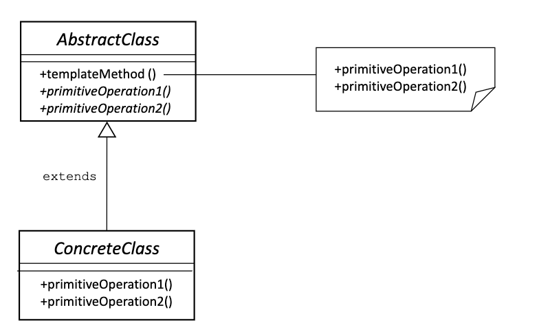
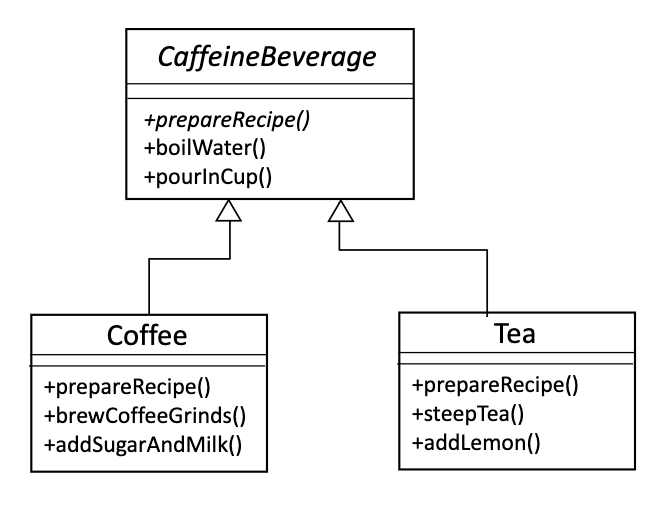
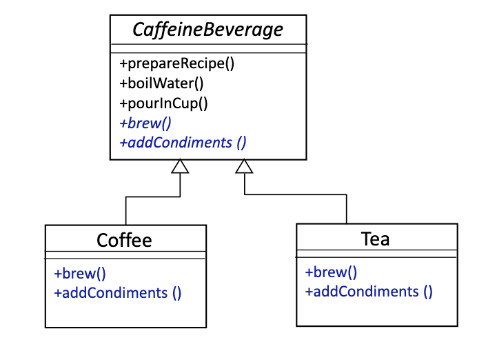

# Template Method Pattern

The Template Method Pattern defines the skeleton of an algorithm in a method, deferring some steps to subclasses. Template Method lets subclasses redefine certain steps of an algorithm without changing the algorithm's structure.
> Template Method defines the steps of an algorithm and allows subclasses to provide the implementation for one of more steps.



- Very Simple, yet powerful pattern
- Used typically in application frameworks
- `primitiveOperation1()` and `primitiveOperation2()` are sometimes referred to as **hook** methods as they allow subclasses to hook their behavior into the service provided by `AbstractClass`

## Example - Starbuzz coffee

Coffee:

1) boil water
2) Brew coffee in boiling water
3) Pour cofee in cup
4) Add sugar and milk

```Java
public class Coffee {
   public void prepareRecipe() {
      boilWater();
      brewCoffeeGrinds();
      pourInCup();
      addSugarAndMilk();
   }

   public void boilWater() {
      System.out.println("Boiling water");
   }

   public void brewCoffeeGrinds() {
      System.out.println("Dripping Coffee through filter");
   }

   public void pourInCup() {
      System.out.println("Pouring into cup");
   }

   public void addSugarAndMilk() {
      System.out.println("Adding Sugar and Milk");
   }
}
```

Tea:

1) Biol water
2) Steep tea in boiling water
3) Pour tea in cup
4) Add lemon

```Java
public class Tea {
   public void prepareRecipe() {
      boilWater();
      steepTeaBag();
      pourInCup();
      addLemon();
   }

   public void boilWater() {
      System.out.println("Boiling water");
   }

   public void steepTeaBag() {
      System.out.println("Steeping the tea");
   }

   public void addLemon() {
      System.out.println("Adding Lemon");
   }

   public void pourInCup() {
      System.out.println("Pouring into cup");
   }
}
```



- Problem: **Code Duplication**
  - We have code duplication occuring in these two classes
  - `boilWater()` and `pourInCup()` are exactly the same for both Coffee and Tea
- Problem: **Similar Algorithms**
  - The structure of the algorithms in `prepareRecipe()` is similar for Tea and Coffee
  - We can improve our code further by making the code in `prepareRecipe()` more abstract
    - `brewCoffeeGrounds()` and `steepTea()` -> `brew()`
    - `addSugarAndMilk`     and `addLemon()` -> `addCondoments()`



## Example: Solution

```Java
public abstract class CaffeineBeverage {
  public final void prepareRecipe() {
    //Note: use of final keyword for prepareRecipe()
    boilWater();
    brew();
    pourInCup();
    addCondiments();
  }
  
  //brew() and addCondiments() are abstract and must be supplied by subclasses
  abstract void brew();
  
  abstract void addCondiments();
  
  //boilWater() and pourInCup() are specified and shared across all subclasses
  void boilWater() {
    System.out.println("Boiling water");
  }
  
  void pourInCup() {
    System.out.println("Pouring into cup");
  }
}

public class Coffee extends CaffeineBeverage {

  public void brew() {
    System.out.println("Dripping Coffee through filter");
  }

  public void addCondiments() {
    System.out.println("Adding Sugar and Milk");
  }
}

public class Tea extends CaffeineBeverage {
  
  public void brew() {
    System.out.println("Steeping the tea");
  }
  
  public void addCondiments() {
    System.out.println("Adding Lemon");
  }
}
```

## Example: Solution w/Hooks

```Java
public abstract class CaffeineBeverageWithHook {
    //prepareRecipe() altered to have a hook method: customerWantsCondiments()
    final void prepareRecipe() {
        boilWater();
        brew();
        pourInCup();
        
        if (customerWantsCondiments()) {
            addCondiments();
        }
    }

    abstract void brew();

    abstract void addCondiments();
  
    void boilWater() {
        System.out.println("Boiling water");
    }

    void pourInCup() {
        System.out.println("Pouring into cup");
    }

    //This method provides a method body that subclasses can override
    // To make the distinction between hook and non-hook methods more clear, you can add the “final” keyword to all concrete methods that you don’t want subclasses to touch
    boolean customerWantsCondiments() {
        return true;
    }
}

public class CoffeeWithHook extends CaffeineBeverageWithHook {
  public void brew() {
    System.out.println("Dripping Coffee through filter");
  }

  public void addCondiments() {
    System.out.println("Adding Sugar and Milk");
  }

  public boolean customerWantsCondiments() {
    String answer = getUserInput();
    if (answer.toLowerCase().startsWith("y")) {
      return true;
    } else {
      return false;
    }
  }

  private String getUserInput() {
    String answer = null;

    System.out.print("Would you like milk and sugar with coffee (y/n)? ");
    BufferedReader in = new BufferedReader(new InputStreamReader(System.in));

    try {
      answer = in.readLine();
    } catch (IOException ioe) {
      System.err.println("IO error trying to read your answer");
    }
    if (answer == null) { return "no"; }
      return answer;
  }
}
```

- Template Method is ideal for creating Frameworks
  - The framework specifies how something should be done with a template method
  - that method invokes abstract hook methods that allow client-specific subclasses to "hook into" the framework and take advantage of its services
