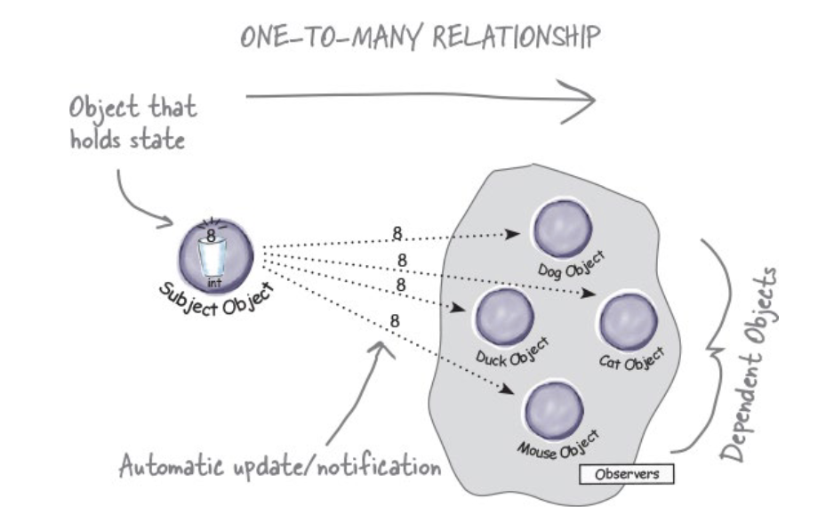
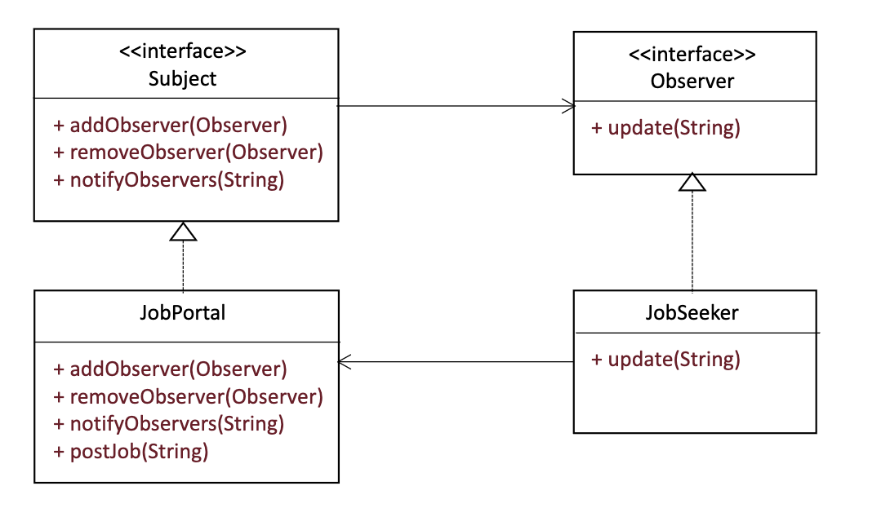

# Observer

- Defines a one-to-many dependancy between objects so that when one object changes state, all its dependents are notified and updated automatically.
- Used to decouple the subject from the observer, since the  subject needs little information to notify the observer.
- Can result in excessive notifications.

## How does an observer work?



- A client will request to become an observer by asking the Subject Object to be registered/subscribe
- That client will then be added into a collection of all observing objects.
- When the Subject gets a new data value, it automatically gets a notification that the Subject has changed.
- A client can then request to be removed from the set of observers, and the subject will acknowledge the request and remove it from the set.


## Example: Job Portal

Consider a job portal where job seekers (observers) subscribe to a job board (subject) to get notified about new job postings

```Java
// This example is without an observer pattern

// Job Seeker (Observer)
class JobSeeker {
private String name;
    public JobSeeker(String name) {
        this.name = name;
    }

    public void notifyNewJob(String job) {
        System.out.println(name + " received job alert: " + job);
        }
}

// Job Portal (Subject)
class JobPortal {
    private JobSeeker candidate1 = new JobSeeker("Snow");
    private JobSeeker candidate2 = new JobSeeker("Cookie");
    private JobSeeker candidate3 = new JobSeeker("Olive");

    public void postJob(String job) {
        //JobPortal manually updates each job seeker when a new job is posted.
        System.out.println("New job posted: " + job);
        candidate1.notifyNewJob(job);
        candidate2.notifyNewJob(job);
        candidate3.notifyNewJob(job);
    }
}

//Main Class
public class BeforeObserver {
    public static void main(String[] args) {
        JobPortal portal = new JobPortal();
        portal.postJob("Software Engineer at Google");
    }
}
```

Problems with this approach:

- **Tightly coupled**: `JobPortal` directly references `JobSeeker`, making it hard to scale.
- **Limited flexibility**: Job seekers cannot subscribe or unsubscribe dynamically
- **Violates Open-Closed Principle**: Adding new typesobs servers requires modifying `JobPortal`

## Example: Job Portal (solution)



```Java
// Subject Interface
interface Subject {
    void addObserver(Observer observer);
    void removeObserver(Observer observer);
    void notifyObservers(String job);
}

// Job Portal (Concrete Subject)
class JobPortal implements Subject {
    private List<Observer> jobSeekers = new ArrayList<>();
    
    @Override
    public void addObserver(Observer observer) {
        jobSeekers.add(observer);
    }
    
    @Override
    public void removeObserver(Observer observer) {
        jobSeekers.remove(observer);
    }
    
    @Override
    public void notifyObservers(String job) {
        for (Observer observer : jobSeekers) {
            observer.update(job);
        }
    }
    
    public void postJob(String job) {
        System.out.println("New job posted: " + job);
        notifyObservers(job);
    }
}

// Job Seeker (Concrete Observer)
class JobSeeker implements Observer {
    private String name;
    private JobPortal jobPortal;

    public JobSeeker(String name, JobPortal jobPortal) {
        this.name = name;
        this.jobPortal = jobPortal;
        jobPortal.addObserver(this);
    }

    @Override
    public void update(String job) {
        System.out.println(name + " received job alert: " + job);
    }
}
// Main Class
public class AfterObserver {
    public static void main(String[] args) {
        JobPortal portal = new JobPortal();
        Observer snow = new JobSeeker("Snow", portal);
        Observer cookie = new JobSeeker("Cookie",portal);
        portal.postJob("Software Engineer at Google");
        
        // snow unsubscribes
        portal.removeObserver(snow);
        portal.postJob("Data Scientist at Amazon"); 
    }
}
```

### Benefits

- **Loose Coupling**: JopPortal doesn't need ot know each JobSeeker explicitly
- **Open-Closed Principle**: We can add more types of observers without modifying JobPortal
- **Dynamic Subscription**: Job Seekers can subscribe and unsubscribe at runtime
