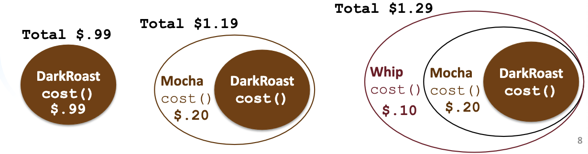
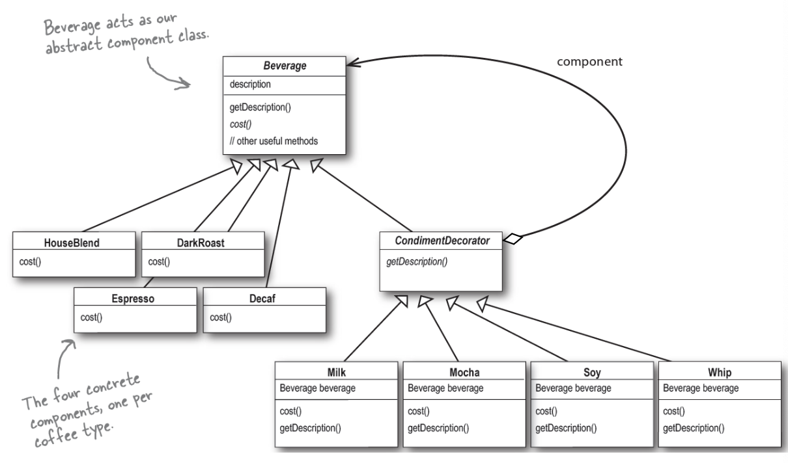

# Decorator Design Pattern

- Attaches additional repsonsiblilties to an object dynamically
- Decorator provides a flesible alternative to subclassing for extending functionality


## Example: StarBuzz Coffee

- Several blends
  - HouseBlend, DarkRoast, Decaf, Espresso
- Condiments
  - Steamed milk, soy, mocha, whipped milk
- Extra charge for each
  - How do we charge all combinations?
  - Classes shoudl be open for extension, but closed for modification
    - Apply the principle to the areas that are most likely to change
  - We want our designs to be resilient to change and flexible enoguh to take on new funcitonality to met changing requirements

## StarBuzz: Solution

Use decorator pattern for StarBuzz



- Start with a beverage and decorate it with condiments at run time
- Example:
  - Take a `DarkRoast` object
  - decorate it with a Mocha object
  - Decorate it with a Whip object
  - call the `cost()` method to rely on delegation to add the condiment costs



- It appears that the `condimentDecorator` is a subclass of `Beveratge`
  - In reality, we are subnclassing to get hte correct type, not to inhered its behavior
  - we can mix and match decorators any way we like at runtime
  
`Beverage` abstract class (Component)

``` Java
public abstract class Beverage {
  String description = "Unknown Beverage";
  
  public String getDescription() { // already implemented
    return description;
  }
  public abstract double cost(); // Need to implement cost()
}
```

`CondimentDecorator` class (decorator):

```Java
abstract class CondimentDecorator extends Beverage {
    public abstract String getDescription();
    //Here we require all the condiment decorators 
    //re-implement the getDescription() method.
}
```

`HouseBlend` class (concrete component)

```Java
public class HouseBlend extends Beverage {

    public HouseBlend() {
    //Note the description variable is inherited from Beverage. To
    //take care of description, put this in the constructor for
    //the class
        description = "House Blend Coffee";
    }

    public double cost() {
    //Compute the cost of a HouseBlend. 
    //Need not to worry about condiments.
        return .89;
    }
}
```

`Mocha` class (concrete decorator):

```Java
//Mocha is a decorator instance, which extends CondimentDecorator
public class Mocha extends CondimentDecorator {
    Beverage beverage;
    //Instantiate Mocha with a reference to a Beverage using:
        //1. An instance variable to hold the beverage we
        //are wrapping.
    public Mocha(Beverage beverage) {
        //2. A way to set this instance to the object
        // we are wrapping – we pass the beverage we
        // are wrapping to the decorator’s constructor
      this.beverage = beverage;
    }

    public String getDescription() {
      return beverage.getDescription()+", Mocha";
      //We want the description to include the beverage –
      //say Houseblend – and the condiments
    }

    public double cost() {
      return .20 + beverage.cost();
      // Cost of condiment + cost of beverage
    }
}
```

`StarbuzzCoffee` class (client):

```Java
public class StarbuzzCoffee {
    public static void main(String args[]) {

        Beverage beverage = new Espresso();   //espresso order,no condiments
        System.out.println(beverage.getDescription()
            + " $" + beverage.cost());

        Beverage beverage2 = new DarkRoast(); // get a DarkRoast
        beverage2 = new Mocha(beverage2);     // wrap it with Mocha
        beverage2 = new Mocha(beverage2);     // warp it with Mocha
        beverage2 = new Whip(beverage2);      // wrap it with a Whip
        System.out.println(beverage2.getDescription()
            + " $" + beverage2.cost());

        Beverage beverage3 = new HouseBlend(); // get a Houseblend
        beverage3 = new Soy(beverage3);        // wrap with Soy
        beverage3 = new Mocha(beverage3);      // wrap with Mocha
        beverage3 = new Whip(beverage3);       // wrap with Whip
        System.out.println(beverage3.getDescription()
            + " $" + beverage3.cost());
    }
}
```

## Additional Example: Java I/O

- `InputStream` class has only `public int read()` bethod to read one byte at a time.
- Decorators such as `Bufferedreader` add functionality to read the stream more easily.

```Java
// InputStreamReader/BufferedReader decorate InputStream
InputStream in = new InputStream("hardcode.txt");
InputStreamReader isr = new InputStreamReader(in);
BufferedReader br = new BufferedReader(isr);

// With a BufferedReader decorator, read an
// entire line from the file in one call
// (InputStream only provides public int read() )
String wholeLine = br.readLine();
```
