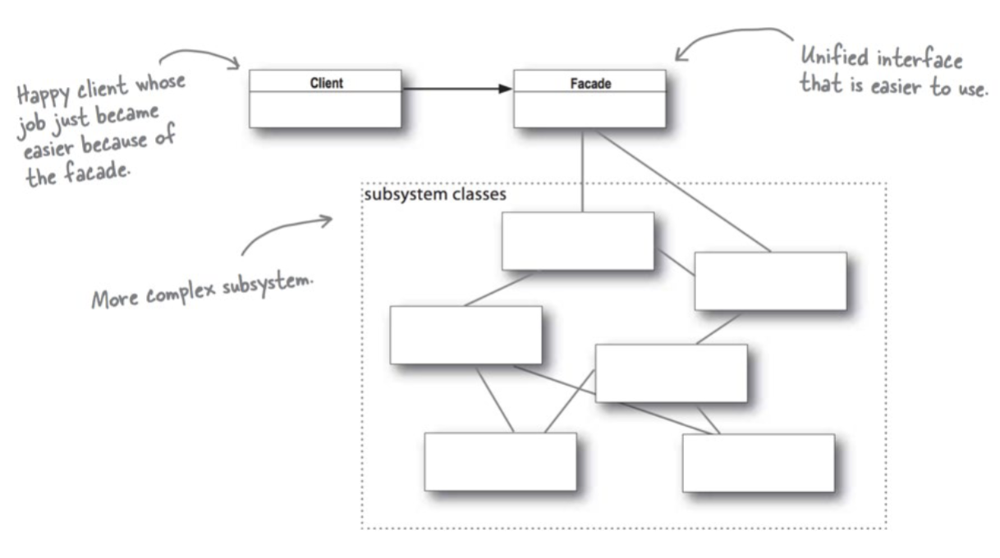
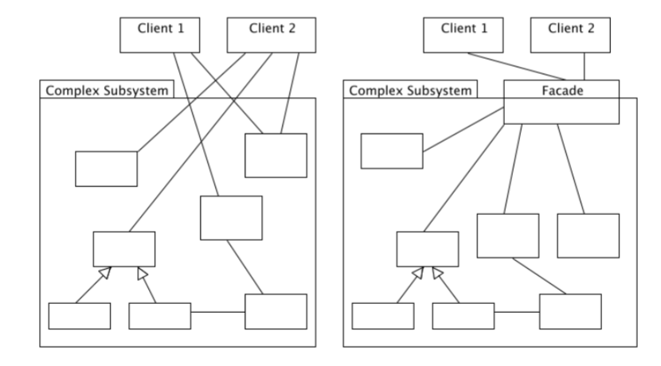
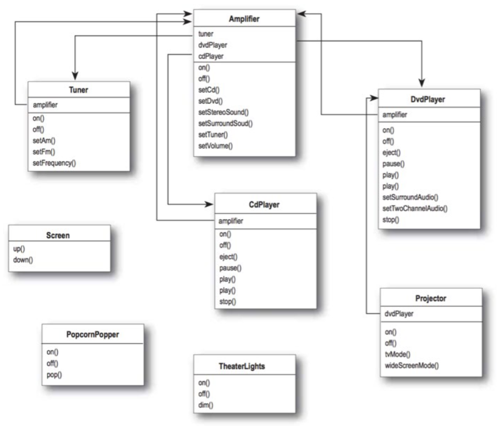
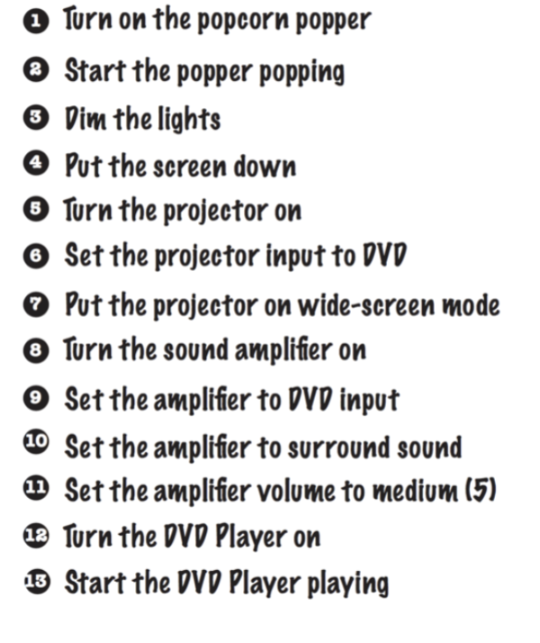
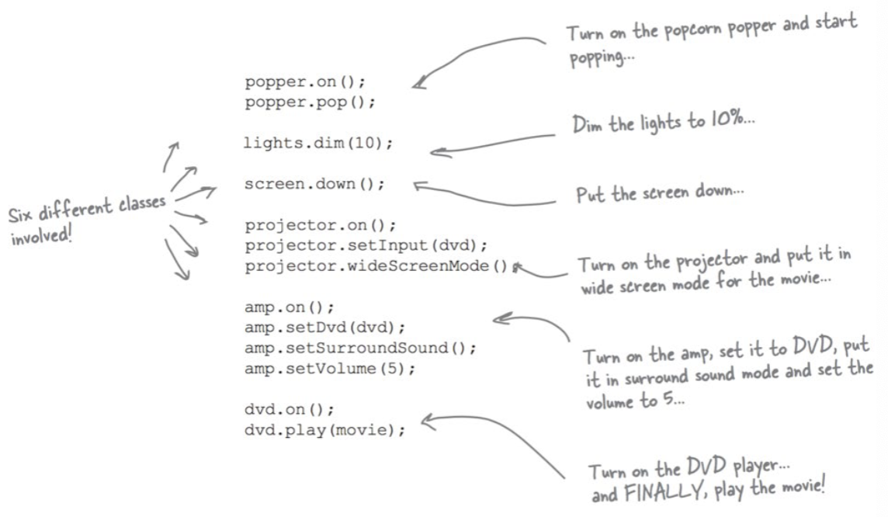
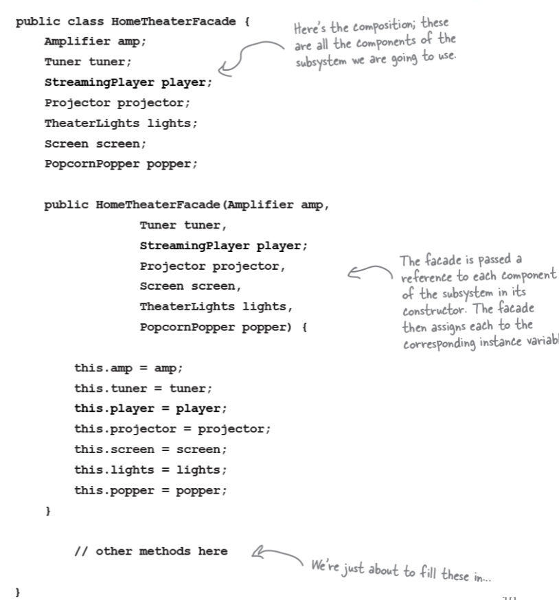
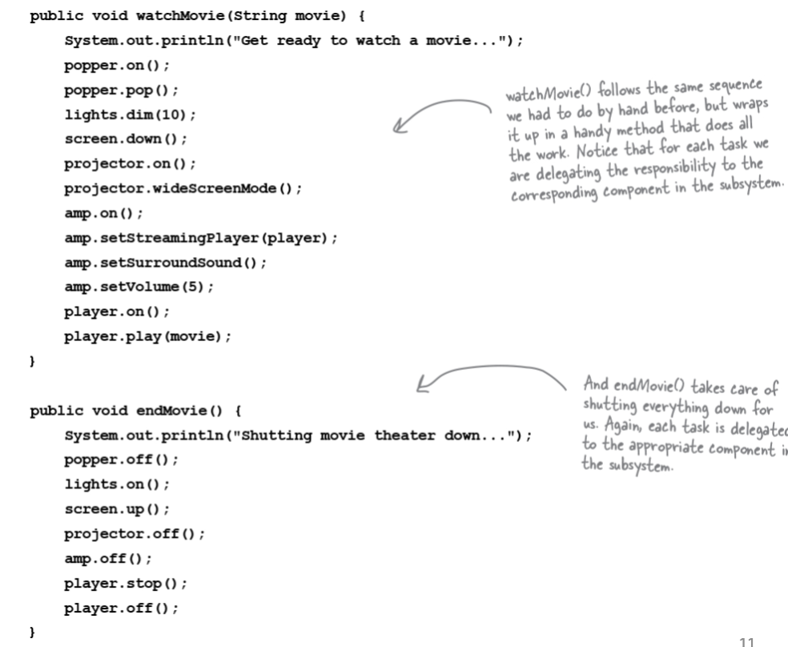
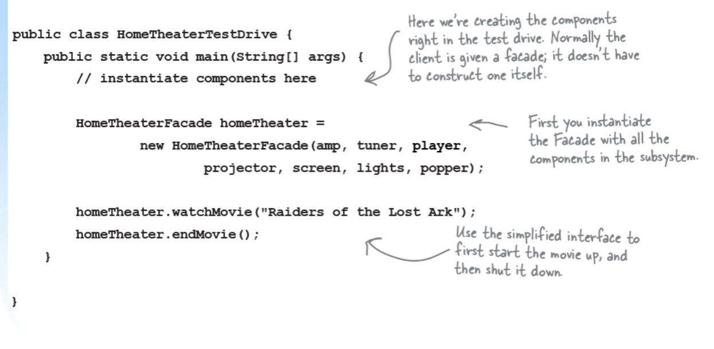

# Facade Pattern

## Interface Segregation Principle (ISP)

> Many client specific interfaces are better than one general purpose interface

- Clients should not be forced to depend upon methods they do not use
  - Interfaces support (belong to) clients
- We usually apply this to the package/component level (Facade pattern)
  - Microsoft DLLs
- Facades help with coupling:
  - The facade pattern provides a unified interface to a set of interfaces in a subsystem. Facade defince a higher-level interface that makes the subsystem easier to use
  - 

## Example: Home Entertainment Center

- There is a lot of classes and a lot of interactions. A big set of interfaces to learn and use.
- Say we want to watch a movie:

- The software view

## example solution

How to use the facade:

